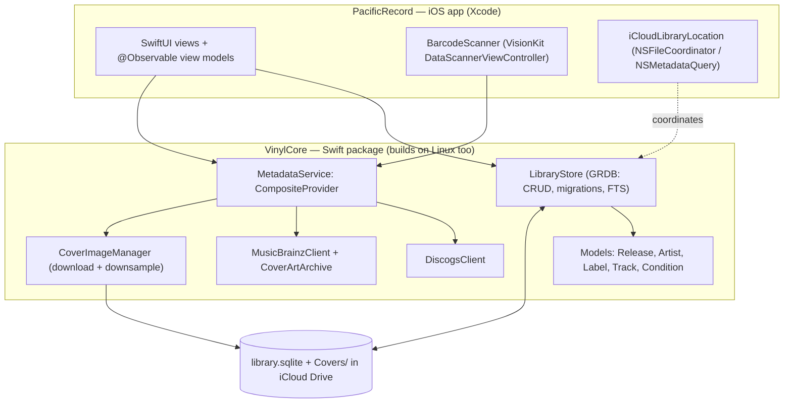
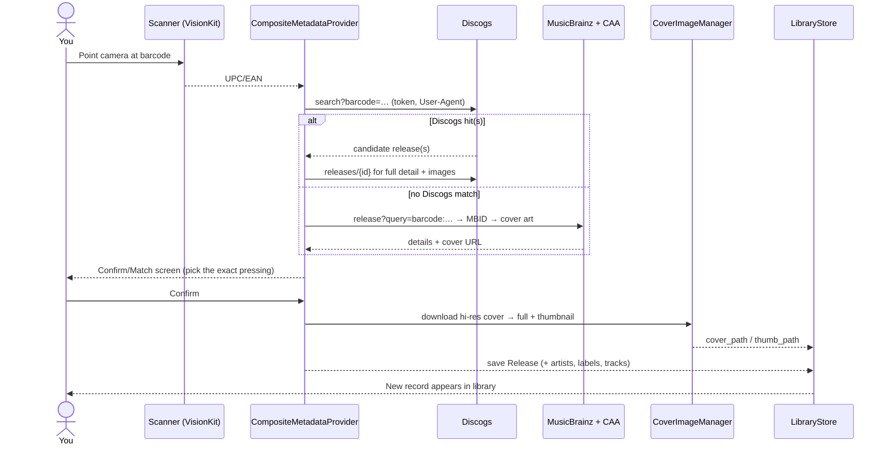

# Pacific Record — Development Plan

An iOS app for cataloguing a vinyl records library, with the library stored as a
portable SQLite database in iCloud Drive so other applications can read it.

---

## 1. Decisions locked in

From the initial scoping conversation:

| Question | Decision |
| --- | --- |
| **Storage / sync** | **iCloud Drive** — the library is a single SQLite file plus a `Covers/` folder, kept in a Files-visible iCloud container so other apps can open it. (CloudKit was ruled out: its private DB is sandboxed to the app and can't be read externally.) |
| **Metadata source** | **Discogs primary, MusicBrainz + Cover Art Archive fallback.** |
| **Fields per record** | **Collector set** — core bibliographic fields + Goldmine media/sleeve condition grades + 0–5 rating + notes. |
| **Distribution** | **Personal** — sideload or TestFlight to your own devices; you supply your own Discogs API token. |

## 2. Assumptions & defaults (change any of these)

- **Platform:** iOS 17+ (needed for VisionKit `DataScannerViewController`, the
  Observation framework, and modern SwiftUI). **iPhone only for v1** (per
  decision) — no iPad-specific layouts or macOS build yet. The `VinylCore`
  package stays platform-neutral so an iPad/Mac UI could be added later without
  touching the data or metadata layers.
- **UI:** SwiftUI, Swift 5.9+ (Swift 6 concurrency where it's low-friction).
- **Database engine:** [GRDB.swift](https://github.com/groue/GRDB.swift) over
  SQLite — chosen because your requirement is a *portable, externally-readable*
  SQLite file with a documented schema. SwiftData / Core Data were rejected: they
  own a private store format that other apps aren't meant to read.
- **Deferred to a later "Full collection manager" phase** (out of scope for v1 so
  the Collector-set decision is respected): purchase price/date, storage
  location/shelf, play counts, custom tags, wishlist/wants, collection stats,
  Discogs *collection* import, and a Nextcloud storage backend. The architecture
  leaves room for all of these.

## 3. Architecture

Two-part split so the testable core can be built even without Xcode/macOS:

- **`VinylCore`** — a pure Swift Package (models, database access via GRDB,
  Discogs/MusicBrainz clients, parsing, thumbnailing math). No UIKit/SwiftUI. This
  builds and unit-tests on **Linux** as well as macOS.
- **`PacificRecord` (iOS app)** — the Xcode project: SwiftUI views, the VisionKit
  barcode scanner, and the iCloud file coordination. Depends on `VinylCore`.



**Layer responsibilities**

- **LibraryStore** — the repository over GRDB: schema migrations, CRUD,
  full-text search, sort/filter queries, and cover-file bookkeeping. Opens the DB
  at the iCloud library-folder URL handed to it by the app.
- **MetadataService** — a `protocol` with `DiscogsClient` and
  `MusicBrainzClient` implementations behind a `CompositeMetadataProvider`
  (Discogs first, MusicBrainz to fill gaps). async/await `URLSession`, per-source
  rate limiting, descriptive `User-Agent`.
- **CoverImageManager** — downloads the highest-resolution cover, writes the
  full image + a downsampled thumbnail (ImageIO / `CGImageSource`) into `Covers/`.
- **iCloudLibraryLocation** (app side) — resolves the ubiquity container,
  triggers downloads of `.icloud` placeholders, coordinates reads/writes with
  `NSFileCoordinator`, watches for external edits, and manages conflicts/backups.
- **BarcodeScanner** (app side) — thin wrapper over VisionKit, emits UPC/EAN
  strings.

## 4. Storage design (iCloud Drive)

**On-disk layout** inside the app's iCloud Documents container (exposed in the
Files app as "Pacific Record" via `NSUbiquitousContainers` +
`LSSupportsOpeningDocumentsInPlace`):

```
Pacific Record/
├─ library.sqlite          # the GRDB database
├─ Covers/
│  ├─ <releaseUUID>.jpg     # full-resolution cover
│  └─ <releaseUUID>_thumb.jpg
└─ .backups/
   └─ library-YYYYMMDD-HHmm.sqlite
```

**Why files, not blobs:** keeping cover images as files (DB stores only relative
paths) lets iCloud sync them incrementally, keeps the DB small and fast, and lets
other apps view the artwork directly.

**SQLite + iCloud correctness — the one real gotcha:**
SQLite's default WAL mode creates `-wal`/`-shm` sidecar files that don't sync
cleanly through iCloud. Mitigation:

- Treat the DB as a *coordinated document*: checkpoint and truncate the WAL
  (`PRAGMA wal_checkpoint(TRUNCATE)`) before yielding the file to iCloud, or run
  in `DELETE` journal mode so the library is always a single self-contained file.
- Wrap opens/reads/writes in `NSFileCoordinator`, and call
  `startDownloadingUbiquitousItem` when the file is still a placeholder.

**Conflicts & safety (v1, typically one active device):**

- Write an automatic timestamped copy into `.backups/` before any risky
  overwrite.
- Detect iCloud conflict versions via
  `NSFileVersion.unresolvedConflictVersionsOfItem` and present a simple
  "keep this / keep that" resolver rather than silently losing data.
- Handle "not signed into iCloud" / "iCloud Drive off" gracefully with a
  local-only fallback and a clear banner.

**Cross-app access:** the schema is documented (`docs/schema.sql`) and stable, so
any SQLite-capable app can read the library. An optional JSON/CSV export can be
added later for apps that don't speak SQLite.

## 5. Data model

Full annotated DDL lives in [`schema.sql`](schema.sql). Summary:

- **`release`** — one row per record, with a denormalized `artist_display` for
  fast lists plus provenance ids (`discogs_release_id`, `musicbrainz_mbid`) and
  relative `cover_path` / `thumb_path`.
- **`artist`** + **`release_artist`**, **`label`** + **`release_label`** —
  normalized many-to-many joins for correct "everything by X" / "everything on
  label Y" queries.
- **`track`** — tracklist, auto-filled from lookups.
- **`release_fts`** — FTS5 full-text index over title/artist/label/catalogue
  number/notes, maintained by `LibraryStore` on write.
- **`library_meta`** — `schema_version` + generator string for external readers.

**Condition grading** uses the standard **Goldmine** scale for both media and
sleeve: `M, NM, VG+, VG, G+, G, F, P`, modelled as a Swift enum in `VinylCore`.

## 6. Metadata & barcode pipeline



**Discogs** (primary): `GET /database/search?barcode=<code>` then
`GET /releases/{id}` for artists, labels, catalogue number, year, country,
genres/styles, formats (incl. speed/descriptions), tracklist, and images
(pick the primary image at full resolution). Auth via a personal token entered in
Settings (created at *discogs.com/settings/developers*). Respect the ~60
req/min authenticated limit, set a descriptive `User-Agent`, and handle HTTP 429.

**MusicBrainz** (fallback): `GET /ws/2/release?query=barcode:<code>&fmt=json` →
release MBID → **Cover Art Archive** `…/release/{mbid}/front-<size>`. Requires a
proper `User-Agent` and ~1 req/sec throttling.

**Match confirmation matters for vinyl:** one barcode often maps to many
pressings. The Confirm/Match screen shows candidate pressings (thumbnail,
country, year, catalogue #) so you pick the exact one before saving. Some older
records have no/duplicate barcodes — text search and manual entry cover those.

**Three entry paths, one shared editable form:** scan, text search, or manual —
all land on the same prefilled-and-editable record form before saving, so you're
always in control of what's stored.

## 7. Screens (SwiftUI)

1. **Library** — cover-art grid ⇄ list toggle; sort (artist, title, year, date
   added, rating); filter (genre, format, condition); FTS search bar.
2. **Record Detail** — large cover (tap for full-screen), all fields, tracklist,
   condition, rating, notes; edit / delete.
3. **Add Record** — entry sheet: *Scan barcode* · *Search by text* · *Enter
   manually* → (match/confirm if from lookup) → editable form → save.
4. **Edit form** — shared with Add; all Collector fields, condition pickers,
   rating, notes; replace cover from lookup, photo library, or camera.
5. **Settings** — Discogs token; iCloud/storage status (last synced, "reveal in
   Files"); backup now / manage backups; metadata source order; about.
6. **Onboarding** — first-run explainer for iCloud storage + optional token entry.

## 8. Roadmap / milestones

- **M0 — Setup:** Xcode app project + `VinylCore` package, GRDB dependency,
  schema + migrations, Linux CI for `VinylCore` tests.
- **M1 — Local library + UI (usable app):** full CRUD against a *local* SQLite
  file; Library grid/list, Detail, manual Add/Edit; cover from photo/camera; FTS
  search, sort, filter. *No cloud or lookup yet — fastest path to something you
  can actually use.*
- **M2 — iCloud Drive storage:** move the library into the iCloud container,
  Files visibility, download coordination, WAL/journal handling, conflict
  resolution, backups, Settings storage status.
- **M3 — Barcode + online lookup:** VisionKit scanner, Discogs client + token
  settings, MusicBrainz fallback, match/confirm screen, hi-res cover download +
  thumbnailing, text search.
- **M4 — Polish & ship:** onboarding, empty/error states, rate-limit UX,
  accessibility (VoiceOver, Dynamic Type), app icon, TestFlight or sideload.
- **Later (Full-manager phase):** purchase price/date, storage location, play
  counts, tags, wishlist, Discogs collection import, CSV/JSON export, stats,
  optional Nextcloud backend.

## 9. Testing

- `VinylCore` unit tests run from the command line with `swift test` (no
  simulator needed): GRDB migrations + CRUD round-trips, FTS search, and
  metadata parsing against recorded Discogs/MusicBrainz JSON fixtures. All
  network access goes through an injectable `HTTPClient`, so no test needs a
  token or a connection.
- iOS-side: lightweight UI tests for the add-record flow; manual QA for
  camera/scan and iCloud sync (hardware-dependent).

## 10. Risks & open considerations

- **SQLite over iCloud (WAL sidecars)** — mitigated by checkpoint/single-file
  journaling + file coordination (§4). The most important thing to get right.
- **Barcode → pressing ambiguity** — solved by the match/confirm picker; manual
  entry for records with no/duplicate barcodes.
- **Discogs limits/terms** — throttle, `User-Agent`, 429 handling; personal-use
  token kept out of source control (see `.gitignore`).
- **iCloud not available** — graceful local-only fallback.
- **Distribution mechanics** — sideloading a free-provisioned build expires
  every 7 days; TestFlight builds last 90 days but need a paid Apple Developer
  account ($99/yr). Worth deciding before M4.

## 11. Status & what's built

The **`VinylCore`** package is scaffolded (see [`../VinylCore`](../VinylCore)):

- Models — `Release`, `Artist`, `Label`, `Track`, `Condition` (Goldmine), plus
  the `RecordDetail` / `LabelCredit` aggregates.
- `LibraryStore` — GRDB migrations for the full schema, save/update/delete,
  sorted listing, `detail(id:)`, and FTS5 search.
- Metadata — `DiscogsClient`, `MusicBrainzClient`, and `CompositeMetadataProvider`
  (Discogs-primary, MusicBrainz-fallback) behind an injectable `HTTPClient`.
- `CoverImageManager` — cover download + ImageIO thumbnailing.
- Tests — DB round-trip, FTS, and Discogs/MusicBrainz parsing against fixtures.

> **Not yet compiled in this environment.** This Linux box's egress policy
> blocks `download.swift.org`, so the Swift toolchain couldn't be installed
> here. The package is written to build with Swift 5.9+ / Xcode; run
> `cd VinylCore && swift test` on your Mac to compile and verify.

## 12. Remaining next steps

1. **On a Mac:** run `swift test` in `VinylCore`, fix any toolchain-specific
   nits, then create the `PacificRecord` iOS app target (SwiftUI) depending on
   the package.
2. **M1 UI:** wire the Library / Detail / Add-Edit screens to `LibraryStore`
   against a local database file.
3. **M2/M3:** add the iCloud container + file coordination, then the VisionKit
   scanner and live metadata lookup.
